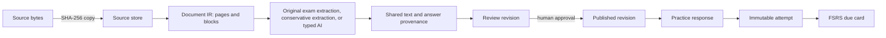

# Architecture and invariants

Python 3.12 supplies the local PDF, OCR, AI, and data-processing ecosystem. Pydantic discriminated unions define typed exercise interactions; FastAPI serves the local API and OpenAPI schema. SQLite WAL, foreign keys, and FTS5 keep each project portable and searchable. Rust/Tauri 2 is the Linux-native shell around the same interface. The web layer is semantic HTML/CSS/JavaScript and ships inside the versioned package, so generated projects need no frontend build step. FSRS schedules review. Rootless Podman with gVisor is the intended isolation boundary for untrusted code.

`SourceRef` links a block to an immutable source ID and optional page, bounding box, block ID, and quotation. `DocumentIR` separates parsing from exercise interpretation. `ExerciseRevision` has a stable exercise ID and unique revision ID. `PassageRevision` stores shared reading text separately; question revisions hold a snapshot and the passage revision ID. Approving a correction creates new question revisions for all current linked items in one transaction. A pending question edit does not displace the last approved revision in practice. `Attempt` stores the submitted response, grade, timestamp, and exact revision ID; it is never updated. Open-response assessments are separate append-only records.

`ImportJob` records source, mode, optional answer-key source, stage, provider, count, collection, progress, usage, and error. The single-writer background queue restarts unfinished jobs. PDF pages are checkpointed in SQLite; a retry reuses the collection and deterministic exercise IDs. Schema `user_version=4` adds shared passages and creates a pre-migration database backup.

Source text and AI output are untrusted data. A generated proposal needs a quotation present in the parsed page, then human approval. Original-exam mode preserves numbered source items; unclear extraction is repaired through a validated transcript and human review. Answer-key references, hidden code cases, SQL reference queries, and plugin private payloads are omitted from the pre-submit public view. The local HTTP service binds to `127.0.0.1` and rejects cross-origin browser writes. It is a single-user service, not a multi-user authenticated server. The browser escapes source text before inserting it into the DOM. Source files are served by ID with `nosniff`; only PDFs and common raster images display inline.

Code and SQL submissions use a checked Podman/gVisor or Docker container by default. Host execution requires both developer flags and is excluded from public application setup. Trusted `VENGINE_PLUGIN_MODULES` are ordinary local application code and must be reviewed by the project owner. A starter includes an empty `project_plugins.py` hook. Registered parsers return `DocumentIR` with `SourceRef` locations; registered proposers return review drafts; AI providers return validated `ProposalBatch` data.

Current boundaries: image-only scans require Tesseract and language data; generic PDF parsing focuses on text/OCR rather than full table/diagram reconstruction; live AI and container isolation need credential-backed and host-backed tests; the native tarball uses system WebKitGTK. See [ROADMAP.md](ROADMAP.md).
